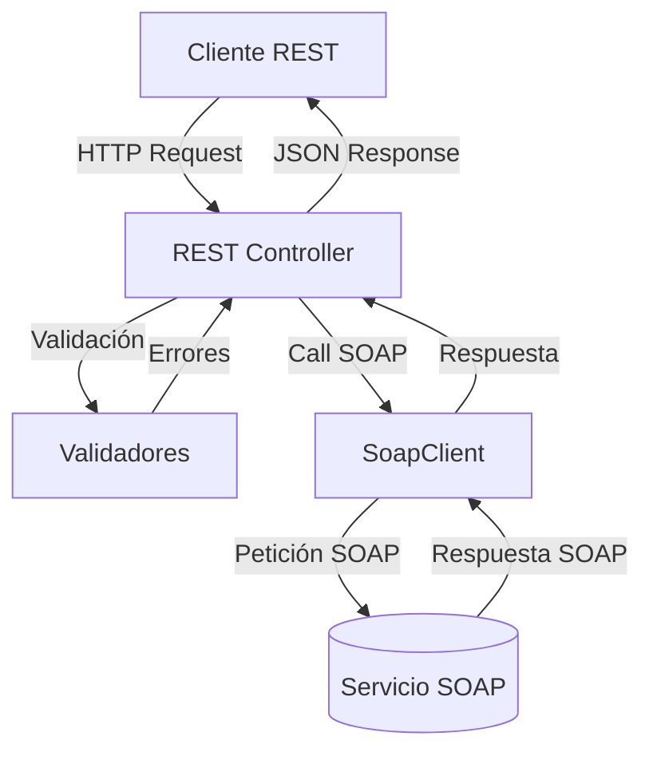

# Wallet REST Service

Servicio REST que actúa como puente hacia el SOAP Service de la billetera virtual. Expone endpoints HTTP para clientes y comercios mientras delega la lógica al servicio SOAP, reutilizando el esquema de respuestas unificado.

## Flujo general

1. **Solicitud REST**: el cliente realiza una petición HTTP (registro, recarga, pago o consulta).
2. **Validación**: se validan los datos de entrada (body o query) y se normaliza el error si corresponde.
3. **Invocación SOAP**: el controlador utiliza `SoapClient` para invocar la operación SOAP correspondiente.
4. **Respuesta**: se retorna la respuesta estándar `{ success, codError, messageError, data }` al consumidor REST.

## Diagrama de flujo



## Ejecución en desarrollo

```bash
npm install
npm run dev
```

Crear un `.env` con:
```
PORT=5000
SOAP_ENDPOINT=http://localhost:4000/wsdl?wsdl
```
El SOAP service debe estar corriendo para completar los flujos.

## Ejecución en producción con Docker

```bash
docker-compose up --build
```

El contenedor expone el puerto `5000`. Ajusta la variable `SOAP_ENDPOINT` para apuntar al servicio SOAP en tu infraestructura (por defecto `http://wallet-soap:4000/wsdl?wsdl`).

## Pruebas

```bash
npm test
```

Los tests usan Jest + Supertest y mockean el cliente SOAP para cubrir flujos felices y errores.
